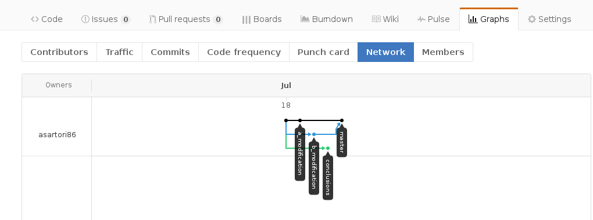

# My First Collaborative Project

First of all, choose who is `AStudent` and who is `BStudent`.

For the first steps, `AStudent` works and `BStudent` looks at him.


## The Template Text

```
This is an extremely interesting text.
This is the result to he work of AStudent 
and BStudent.

Meanwhile BStudent calls up AStudent. BStudent 
tells him he will improve this part of the text, 
he will do this on a different branch so that he 
will not interfere with AStudent’s work.
*PLACE HOLDER: BSTUDENT HAS A CRUCIAL IMPROVEMENT*

AStudent suddenly realizes that there is a 
very nice text, that copes very nicely with 
what BStudent is about to write. This is why 
he is creating a new branch and writing 
his text here. 
*PLACE HOLDER: ASTUDENT'S TEXT*

Before merging the two branches, AStudent
writes a very nice conclusion for the document
and commits it.
*PLACE HOLDER: (ASTUDENT or BSTUDENT)'S TEXT*
```

## Collaborative Development


This is meant to be a simple collaborative project between `AStudent` and `BStudent`.

`AStudent` creates a directory in its home and `cd` in it:

```
$ cd ~
$ mkdir my_first_collaborative_project
$ cd my_first_collaborative_project
```

`AStudent` gets the above file

	wget https://raw.githubusercontent.com/asartori86/codata_2017/master/very_interesting_text.txt


Now `AStudent` initialize a git repository in the current directory

```
$ git init
Initialized empty Git repository in /home/alberto/my_first_collaborative_project/.git/
```

`AStudent` asks git what's the status of the repository he created:

```
$ git status
On branch master

Initial commit

Untracked files:
  (use "git add <file>..." to include in what will be committed)

	very_interesting_text.txt

nothing added to commit but untracked files present (use "git add" to track)
```

Now `AStudent` tells git he wants to track `very_interesting_text.txt`:

```
$ git add very_interesting_text.txt
```

Check the status again

```
$ git status
On branch master

Initial commit

Changes to be committed:
  (use "git rm --cached <file>..." to unstage)

	new file:   very_interesting_text.txt

```

And he commits it

```
$ git commit -m "first commit"
[master (root-commit) 15ec2cc] first commit
 1 file changed, 0 insertions(+), 0 deletions(-)
 create mode 100644 very_interesting_text.txt
```

The developed repository is only local at the moment. Suppose we want to add a remote copy of our repository. To do this we sign in on github, and create a repository with the very same name (to simplify things) of our local repo


We want to exchange information in between the local repository  and the remote one. To do this we need to tell git there exists a `remote` repository and we label it `origin`

```
$ git remote add origin https://github.com/asartori86/my_first_collaborative_project.git
```

To copy our work on the remote repository we need to `push` our changes on it:

```
$ git push origin master
Username for 'https://github.com': asartori86
Password for 'https://asartori86@github.com': 
Counting objects: 3, done.
Delta compression using up to 4 threads.
Compressing objects: 100% (3/3), done.
Writing objects: 100% (3/3), 562 bytes | 0 bytes/s, done.
Total 3 (delta 0), reused 0 (delta 0)
To https://github.com/asartori86/my_first_collaborative_project.git
 * [new branch]      master -> master
```

It is time for `BStudent` to join the game. To do so, `AStudent` has to give him permission to edit the project:


`BStudent` has to accept the invitation to collaborate, then he clones his own local version of the repository:

```
$ git clone https://github.com/AStudent/my_first_collaborative_project.git
$ cd my_first_collaborative_project/
```

`BStudent` creates his own branch for his modifications:

```
$ git checkout -b b_modification
Switched to a new branch 'b_modification'
```


`BStudent` edits `very_interesting_text.txt`.

```
$ git status
On branch b_modification
Changes not staged for commit:
  (use "git add <file>..." to update what will be committed)
  (use "git checkout -- <file>..." to discard changes in working directory)

	modified:   very_interesting_text.txt
```

We should be familiar by now with adding and committing our modifications:

```
$ git add very_interesting_text.txt
$ git commit -m "b modification"
[b_modification bc2fb56] b modification
 1 file changed, 1 insertion(+), 1 deletion(-)
```

`BStudent` has accomplished his task and so it pushes to the remote repository

```
$ git push origin b_modification
Username for 'https://github.com': bstudent_user_name
Password for 'https://asartori86@github.com': 
Counting objects: 3, done.
Delta compression using up to 4 threads.
Compressing objects: 100% (3/3), done.
Writing objects: 100% (3/3), 562 bytes | 0 bytes/s, done.
Total 3 (delta 0), reused 0 (delta 0)
To https://github.com/asartori86/my_first_collaborative_project.git
 * [new branch]      b_modification -> b_modification
 ```

`AStudent` works on the same file but on different branch:

```
$ git checkout -b a_modification
Switched to a new branch 'a_modification'
```

`AStudent` edits `very_interesting_text.txt`.

```
$ git diff
diff --git a/very_interesting_text.txt b/very_interesting_text.txt
index 5f74e97..0e4cce7 100644
--- a/very_interesting_text.txt
+++ b/very_interesting_text.txt
@@ -13,7 +13,7 @@ very nice text, that copes very nicely with
 what BStudent is about to write. This is why 
 he is creating a new branch and writing 
 his text here. 
-*PLACE HOLDER: ASTUDENT'S TEXT*
+This is a text that couples well with Bstudent's
```

```
$ git add very_interesting_text.txt 
$ git commit -m "a modification"
$ git push origin a_modification
```

Now `AStudent` or `BStudent` wants to write the conclusion. It is a good practice to work on different branches for different tasks. First, he gets back to the master branch:

```
$ git checkout master
Switched to branch 'master'
```

He moves to a new branch:
```
$ git checkout -b conclusions
```

Then he edits the conclusions of `very_interesting_text.txt`.

```
$ git diff
diff --git a/very_interesting_text.txt b/very_interesting_text.txt
index 2e9fe27..3c0bd13 100644
--- a/very_interesting_text.txt
+++ b/very_interesting_text.txt
@@ -18,4 +18,4 @@ his text here.
 Before merging the two branches, AStudent
 writes a very nice conclusion for the document
 and commits it.
-*PLACE HOLDER*
+This is the end, my only friend the end!
```

```
$ git add very_interesting_text.txt 
$ git commit -m "conclusion"
[master 047fddf] conclusion
 1 file changed, 1 insertion(+), 1 deletion(-)
$ git push origin conclusions
Counting objects: 3, done.
Delta compression using up to 4 threads.
Compressing objects: 100% (3/3), done.
Writing objects: 100% (3/3), 319 bytes | 0 bytes/s, done.
Total 3 (delta 1), reused 0 (delta 0)
To https://github.com/asartori86/my_first_collaborative_project.git
 * [new branch]      conclusions -> conclusions
```

If we take a look at the `Network`, under `Graphs` sheet, on github page we see the status of the four branches `master`, `a_modification`, `b_modification` and `conclusions`.


`BStudent` now takes the responsibility to merge the work made on branch `a_modification`. To do so he has to `fetch` the information on the remote branch:

```
$ git fetch 
remote: Counting objects: 6, done.
remote: Compressing objects: 100% (4/4), done.
remote: Total 6 (delta 3), reused 5 (delta 2), pack-reused 0
Unpacking objects: 100% (6/6), done.
From https://github.com/asartori86/my_first_collaborative_project
 * [new branch]      a_modification -> origin/a_modification
 * [new branch]      conclusions    -> origin/conclusions
```

`Bstudent` goes back on `master` and merge branch `origin/a_modification` onto its *local* master branch:

```
$ git checkout master
$ git merge origin/a_modification
Updating c98c919..533f5eb
Fast-forward
 very_interesting_text.txt | 2 +-
 1 file changed, 1 insertion(+), 1 deletion(-)
```
Then, he pushes to origin
```
$ git push origin master
Username for 'https://github.com': asartori86
Password for 'https://asartori86@github.com': 
Total 0 (delta 0), reused 0 (delta 0)
To https://github.com/asartori86/trial.git
   c98c919..533f5eb  master -> master
```


Now `AStudent` merges branch `origin/b_modification`:

```
$ git fetch
$ git checkout master
Switched to branch 'master'
Your branch is behind 'origin/master' by 1 commit, and can be fast-forwarded.
  (use "git pull" to update your local branch)
```

Git is warning `AStudent` that his local branch is not up to date. To do so, `AStudent` needs to `merge` from the remote:

```
$ git merge origin/master
Updating edda7a7..b74ff8f
Fast-forward
 very_interesting_text.txt | 2 +-
 1 file changed, 1 insertion(+), 1 deletion(-)
```

Note we did two steps

	$ git fetch
	$ git merge origin/master

git allows us to do the two steps with one `pull` command

	$ git pull origin master

`pull = fetch + merge`

`AStudent` can merge the work of `BStudent`. A default message will appear, committing the merging operation into a new commit:

```
$ git merge origin/b_modification 
$ git push origin master
```



The very same process can be operated for the branch `conclusions`:

```
$ git merge origin/conclusions 
 git push origin master 
```


# Optional (advanced)
In order to make the history clearer, the author of the patch stored on branch `conclusions`, before it is merged, rebases it on the current `origin/master`. The situation is as follows


The author goes on branch `conclusions` and double-check everything is fetched

```
$ git checkout conclusions
$ git fetch
```
Then, he runs:
```
$ git rebase origin/master
First, rewinding head to replay your work on top of it...
Applying: conclusion
```

The command `rebase` changes the history: the date of commit `conclusion` is shifted after the last merge commit. This can be verified typing
```
git log
```
Since the history has been changed, the author *cannot* simply runs `git push origin conclusions`
```
$ git push origin conclusions
Username for 'https://github.com': asartori86
Password for 'https://asartori86@github.com': 
To https://github.com/asartori86/trial.git
 ! [rejected]        conclusions -> conclusions (non-fast-forward)
error: failed to push some refs to 'https://github.com/asartori86/trial.git'
hint: Updates were rejected because the tip of your current branch is behind
hint: its remote counterpart. Integrate the remote changes (e.g.
hint: 'git pull ...') before pushing again.
hint: See the 'Note about fast-forwards' in 'git push --help' for details.
```

The author needs to run a *force push*
```
$ git push -f origin conclusions
Username for 'https://github.com': asartori86
Password for 'https://asartori86@github.com': 
Counting objects: 3, done.
Delta compression using up to 4 threads.
Compressing objects: 100% (2/2), done.
Writing objects: 100% (3/3), 283 bytes | 0 bytes/s, done.
Total 3 (delta 1), reused 0 (delta 0)
To https://github.com/asartori86/trial.git
 + 1ff218a...41520d8 conclusions -> conclusions (forced update)
```

Now the network looks as follows


Note that the branch `conclusions` it is now checkout-ed from the latest commit on `origin/master`. Time to merge now:

```
$ git checkout master
$ git fetch
$ git merge origin/conclusions
```


